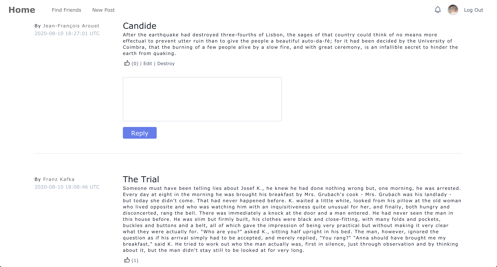

# README

* https://www.theodinproject.com/courses/ruby-on-rails/lessons/final-project

This is the final project of The Odin Project. 

Frontend: Tailwind CSS

Email: Sendgrid

Active Storage: AWS

Hosting: Heroku

I removed FB Omniauth from production as it requires HTTPS and I didn't want to buy an SSL certificate, but it's otherwise a vanilla Rails project.

The only other gems I used are all quite standard: will_paginate, rubocop, devise, faker, and letter_opener. 

It's not really responsive - it technically works but the layout isn't built for mobile.

